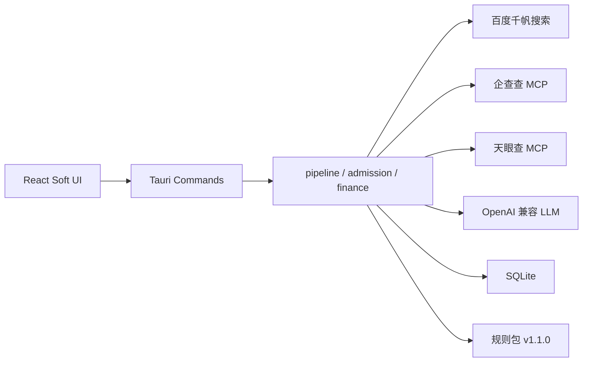

# 智鉴风控官 · Axiom Risk Agent

面向消费金融合作机构的全生命周期风险管理桌面客户端。覆盖 **准入前置核验 → 存续期舆情吹哨 → 季度经营复盘**。

| 项 | 说明 |
|---|---|
| 产品名称 | 智鉴风控官（Axiom Risk Agent） |
| 形态 | Tauri 2 本地桌面应用（macOS / Windows） |
| 技术栈 | Rust + React 19 + TypeScript + Vite + Tailwind（Soft Dashboard） |
| 本地库 | SQLite（WAL），默认路径见下文 |
| 需求基线 | [`docs/需求文档.md`](docs/需求文档.md) |

六类合作主体：助贷、融资担保、流量引流、支付、数据服务、催收。

---

## 功能模块

侧栏共 8 个页面：

| 页面 | 作用 |
|---|---|
| **总览** | 监测看板：KPI、健康分、六类卡片、趋势、1/2 级事件 |
| **风险吹哨** | 监测范围、定时跑批、出日报/周报、线索复核 |
| **经营守护** | 上传财报附件，AI 抽取指标并生成四维评分看板 |
| **准入瞭望** | 输入公司全称，一键红橙黄清单研判 |
| **机构名单** | 下载固定 Excel 模板，导入 / 逐条维护（不走 LLM） |
| **规则库** | 基线规则 v1.1.0 + 导入 / 对话微调 / 覆盖 |
| **问鉴控** | OpenAI 兼容 Agent，可调跑批、名单、百度千帆搜索、企查查等工具 |
| **设置** | 大模型、百度千帆全网搜、企查查 / 天眼查 MCP Key（本地加密） |

---

## 核心流程

### 1. 风险吹哨

点「出日报 / 出周报」或到点定时任务后：

1. 按监测范围取机构（全部或指定；主界面预览最多 5 家，完整名单在弹窗中选择/查看）。
2. **百度千帆**全网搜（自然语言，不按布尔 `OR` 执行）。问句带机构短名（Excel 简称优先，否则从全称压「融担/数科」等）：
   - **只勾 1 家**：2 次 HTTP——经营崩盘句 + 监管/消保句。
   - **2 家及以上**：每家 1 次 HTTP，形如 `"短名" 最近有没有爆雷停摆跑路资金池失联处罚投诉立案暴力催收`。跑批上限约 250 次，不把多家名字打进同一句。
3. 时间窗用千帆 `page_time`（自然日）+ 本地发布日期门：日报对应当日，周报对应该自然周。线索日期以页面发布日为准，不用正文里的「出事当天」覆盖。
4. 命中须标题含风险词（丢掉宣传稿）；再按机构词库（全称 / 简称 / 集团 / 信用代码 / 关联方）归属。
5. 已配置 LLM 时做 AI 研判分级（超时回退规则）；规则按主体词 AND 风险词取最严重等级。无规则命中时保留为 L4。
6. 来源可信度 A/B/C 仍展示，**不再**因 C 类来源把 L1/L2 强制降为 L3。L1/L2 状态仍为「待复核」。
7. 同一 URL+标题哈希去重。日报/周报**只组装本次跑批线索**，不会把库里其它日期的旧 L1 塞进本期报告。生成过程有遮罩（跑批在后台线程）。

四级含义：

| 等级 | 含义 |
|---|---|
| L1 | 重大违法违规、监管处罚/立案、恶性舆情，立即处置 |
| L2 | 明确违规或较大负面，限期处置 |
| L3 | 风险苗头或一般负面，持续关注 |
| L4 | 弱相关、信息价值有限，留档 |

黑猫投诉源当前为空适配器，不再注入演示数据。

### 2. 准入瞭望

输入公司全称 → 按名称猜测类型（担保/催收/支付/数据/引流，否则助贷）→ 后台独立线程 `run_review`（进度条文案按秒切换，不是真实步骤回调）。

1. **取证**（无 AI）
   - 本地风险线索（公司名能对上的吹哨线索）
   - 本次粘贴材料 / 已入库知识库（页面入口已下线，旧数据仍会读）
   - 百度千帆全网搜：最多 **2** 次 HTTP，最近约半年（`page_time` 约 183 天）。短名规则与吹哨相同，不写 OR：
     - `"短名" 最近有没有爆雷停摆跑路资金池失联处罚投诉立案暴力催收`
     - `"短名" 最近有没有工商变更诉讼被执行`
   - 企查查 / 天眼查 MCP：设置就绪才打。准入**只调企查查 `company` 一次**（工商主体快照），不调股东沿革 / 失信 / 诉讼等其它 Server；失败记「企查查未完成」，不阻塞出报告。页面准入不传统一社会信用代码，有名单 `partner_id` 时才用机构上的代码。
2. **网页过滤**：正文必须出现本公司全称或短名；爱企查「开庭公告详情」导航里的「失信被执行人 / 行政处罚」不当事实；融担当原告追偿不算大额诉讼，只有本公司作为**被告**才打 Y04。
3. **匹配**：证据正文含检查项关键词即触发（红/橙及监管罚款项还要求关键词落在机构名附近）。通用项全类型都跑，带类型限制的只跑对应业态。本地 L3/L4 线索不能触发红项。
4. **结论（规则，LLM 不能改）**：红 → 否决；无红有橙 → 有条件通过；无外部取证（全网搜/企查查/天眼查均未成功）或融担证据里完全没有放大倍数/代偿率/准备金/在保余额 → **待核验**；其余 → 通过。黄项只进持续监控，不单独改结论。
5. **AI 只写分析说明**（禁止编造案号/处罚文号；工商字段以企查查/天眼查为准）。看「本次取证」标签判断工商 MCP 是否打通，不要用 AI 正文里的「材料未提供工商」反推失败。结果落库并进历史。

处罚分层：O02 仅认罚款 ≥100 万或监管公开通报；未达该线的监管罚单（如 19 万）记 **Y08**，必须在黄色关注里体现，不能消失，也不能当成失信否决。

#### 红 / 橙 / 黄检查项

颜色只有红橙黄，没有绿灯检查项。「通过」是清单未命中且证据足够时的结论。

**红 · 一票否决（任意命中即否决）**

| ID | 检查项 | 适用类型 |
|---|---|---|
| R01 | 被列入严重违法失信名单 | 全部 |
| R02 | 被列为失信被执行人 | 全部 |
| R03 | 吊销许可证 / 责令停业整顿 | 全部 |
| R04 | 融担放大倍数超红线（>10/15 倍） | 融担 |
| R05 | 为控股股东/实控人提供担保 | 融担 |
| R06 | 从事吸收存款/自营贷款等禁止业务 | 融担 |
| R07 | 实控人失联 / 主要股东股权冻结>30% | 全部 |
| R08 | 暴力催收或侵犯公民个人信息刑事立案 | 催收、助贷 |
| R09 | 综合融资成本超过 24% | 助贷 |
| R10 | 未纳入银行名单制管理 | 助贷 |
| R11 | 支付牌照被注销/暂停 | 支付 |
| R12 | 数据违规被刑事立案 | 数据 |

**橙 · 重大违规（无红有橙 → 有条件通过）**

| ID | 检查项 | 适用类型 |
|---|---|---|
| O01 | 未自主风控 / 核心风控外包 | 助贷 |
| O02 | 大额行政处罚（罚款≥100 万）/ 监管公开通报 | 全部 |
| O03 | 集中度超标 / 准备金不足 / 资产比例不合规 / 财务造假信号 | 融担 |
| O04 | 出现违规催收行为 | 助贷、催收 |
| O05 | 同业多家解约 | 全部 |
| O06 | 数据来源合规性质疑 / 数据安全事件 | 数据、引流 |
| O07 | 经营资质存续异常 | 全部 |
| O08 | 外部信用评级下调 | 全部 |
| O09 | 违规催收举报集中爆发 | 催收 |
| O10 | 备付金违规 / 反洗钱处罚 | 支付 |

**黄 · 关注（不单独改结论）**

| ID | 检查项 | 适用类型 |
|---|---|---|
| Y01 | 不良率恶化 / 代偿率上升 | 助贷、融担 |
| Y02 | 营收连续下滑 | 全部 |
| Y03 | 非标审计意见 / 管理层变更 | 全部 |
| Y04 | 大额诉讼（>净资产 5%） | 全部 |
| Y05 | 监管评级 C/D 级 | 融担 |
| Y06 | 催收投诉异常增长 / 消保约谈 | 催收、助贷 |
| Y07 | 经营异常名录 | 全部 |
| Y08 | 监管行政处罚（未达大额线） | 全部 |

命中方式以关键词为主，并做主体邻近与开庭公告模板过滤。R02 须「被列入失信被执行人名单 / 限制高消费令」等表述，孤立的「限制高消费」不够。无全网搜/企查查/天眼查任一成功标签时，即使红橙全灭也是 **待核验**，不会绿灯放行。

### 3. 经营守护

上传 Word / Excel / TXT（暂不支持 PDF、旧版 .doc），需已配置大模型。AI 抽取指标，生成四维评分与财报看板，并支持同业横向对比与历史库。CSV 批量导入和季度全量批跑入口已从页面移除。

---

## 技术架构



- 前端：`src/` React 页面与组件。
- 后端：`src-tauri/src/` Rust。耗时任务（准入、出日报）走 `spawn_blocking` + 独立 SQLite 连接，避免冻 UI。
- 密钥：AES-GCM 加密写入本地库，不明文落盘。

---

## 目录

```
src/                         React UI
  pages/                     总览 / 吹哨 / 经营 / 准入 / 名单 / 规则 / 问鉴控 / 设置
  components/                看板、弹窗、机构范围选择器、Soft UI 下拉
  api.ts                     Tauri invoke 封装
src-tauri/src/
  pipeline.rs                吹哨跑批
  baidu_search.rs            千帆全网搜、问句与时间窗
  whistle_ai.rs              全网搜命中 AI 分级
  whistle_reports.rs         日/周报与定时
  admission.rs               准入清单与结论引擎
  finance.rs                 财报分析
  enterprise_mcp.rs          企查查 / 天眼查
  rules/                     基线 YAML + 导入 + 对话改规则
  partners.rs                名单词库与导入
  db.rs                      SQLite schema
  agent.rs                   问鉴控工具
docs/需求文档.md             产品需求基线
src-tauri/resources/rules/   规则 YAML v1.0.0 / v1.1.0
```

---

## 环境准备

1. Node.js 18+、Rust（[rustup](https://rustup.rs)）、Tauri 系统依赖（见 [Tauri 前置条件](https://v2.tauri.app/start/prerequisites/)）。
2. 克隆本仓库后安装依赖：

```bash
npm install
```

3. 桌面端启动后到 **设置** 按需配置（均可测连通）：

| 配置 | 用途 |
|---|---|
| 大模型 Base URL / Model / API Key | 吹哨 AI 分级、准入分析说明、财报抽取、问鉴控 |
| 百度千帆 API Key | 吹哨跑批与准入全网搜（自然语言检索；准入单次最多 2 次 HTTP） |
| 企查查 / 天眼查 MCP Key | 准入工商补证；问鉴控可调更多企查查 Server（risk/case 等）。准入一键分析只打 company |

未配置时：吹哨可回退规则定级；准入缺少外部取证则结论为待核验；财报分析会提示先配模型。

---

## 本地运行

```bash
# 仅前端（浏览器）。桌面命令不可用，无本地库、无真实跑批
npm run dev

# 桌面端（完整能力）
npm run tauri dev
```

前端开发地址：`http://localhost:1421`。

打包（发给同事即可，不用上架）：

**本机打 Mac 包**（你现在这台 Mac）：

```bash
cd /Users/wanfeng/IdeaProjects/axiom-risk-agent
npm install
npm run tauri build
```

安装包在：

- `src-tauri/target/release/bundle/dmg/`（`.dmg`，发给别人用这个）
- `src-tauri/target/release/bundle/macos/`（`.app`）

未签名时，对方第一次打开可能要到「系统设置 → 隐私与安全性」点仍要打开。

**Windows 包不要在 Mac 上打。** 用 GitHub Actions（已加手动工作流）：

1. 先把 `.github/workflows/build.yml` 推到 GitHub。
2. 打开仓库 → **Actions** → **Build installers** → **Run workflow**。
3. 跑完后进该次运行，下载制品 `macos-arm64`、`windows-x64`。

Windows 产物是 NSIS 的 `.exe`。对方没装 WebView2 时，安装器/启动时会提示自动下载。

有一台 Windows 电脑时也可以在那边执行同样的 `npm run tauri build`，产物在 `src-tauri/target/release/bundle/nsis/`。

---

## 数据与安全

- 数据库默认：`{系统 data 目录}/axiom-risk-agent/axiom.db`（macOS 一般为 `~/Library/Application Support/axiom-risk-agent/axiom.db`）。
- 主要表：`partners`、`risk_clues`、`whistle_reports`、`admission_reviews`、`finance_reports`、规则覆盖、审计日志、加密配置。
- 机构名单 / 规则库用固定 Excel 模板全量导入，不经过大模型。
- 操作写入审计日志。L1/L2 线索关闭需人工复核路径。

---

## 当前能力与边界

**已落地**

- Soft UI 总览与八个业务页
- 名单 / 规则 Excel 模板导入与维护
- 百度千帆全网搜 + 日/周报 + 指定机构范围（一家一句，不写 OR）
- 准入红橙黄 **30** 项清单与结论引擎（含待核验、Y08 监管罚款）
- 财报附件分析看板
- 问鉴控 Agent、设置页密钥与连通测试

**明确不做 / 未接**

- 黑猫等投诉站点真实采集（适配器为空）
- 替代核心信贷决策
- 无授权爬虫、验证码绕过
- 知识图谱 / BERT 等自研模型（规划中，当前规则 + LLM）
- 移动端；企业微信 / 邮件告警通道

---

## 相关文档

| 文档 | 内容 |
|---|---|
| [docs/需求文档.md](docs/需求文档.md) | 产品需求、六类规则阈值、准入意见书模板、分期与验收 |
| 本 README | 与当前代码对齐的使用说明、流程与检查项 |
