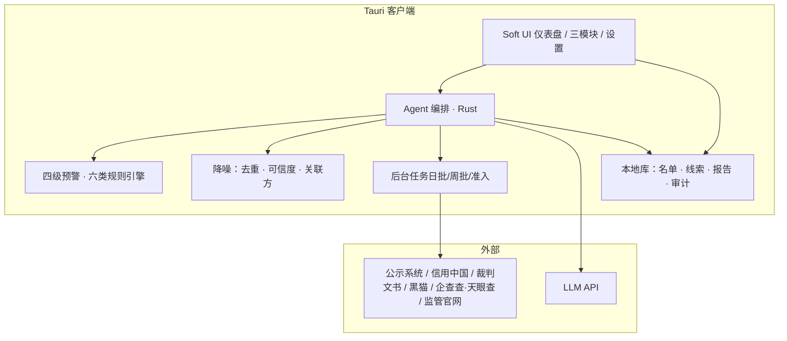
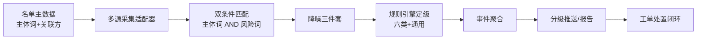
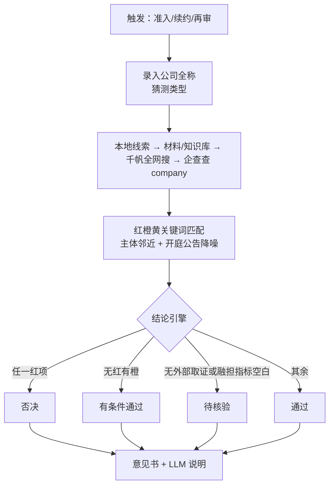

# 智鉴风控官 · 合作机构风险管理 AI 智能体客户端 — 产品需求文档（PRD）

| 属性 | 内容 |
|------|------|
| 文档版本 | v1.3 |
| 创建日期 | 2026-07-30 |
| 更新日期 | 2026-08-21 |
| 产品名称 | 智鉴风控官（Axiom Risk Agent） |
| 产品定位 | 面向风控/合规/业务的合作机构全生命周期 AI 智能风控客户端 |
| 技术栈 | Tauri 2.x + Rust + React + TypeScript + Tailwind |
| 文档依据 | 《智鉴风控官—合作机构全生命周期 AI 智能风控系统》立项报告；《合作机构风险管理 AI 系统_详细规划》；当前桌面端实现 |
| 文档状态 | 需求基线；v1.3 对齐已落地能力 |
| 变更说明 | v1.1 补齐吹哨/经营/准入方案。v1.2：吹哨改为全网搜滚动窗、去掉黑猫演示。v1.3：全网搜改为百度千帆自然语言检索（不写 OR）；准入取证/降噪/处罚分层（Y08）与待核验结论落地。工程说明见仓库根目录 `README.md`。 |

---

## 0. 实现对照（2026-08-21）

| 能力 | 状态 | 说明 |
|------|------|------|
| Soft UI 总览 / 八个业务页 | 已落地 | 总览、吹哨、经营、准入、名单、规则、问鉴控、设置 |
| 机构名单 / 规则库 Excel 模板 | 已落地 | 固定模板全量导入，不走 LLM |
| 风险吹哨跑批 | 已落地 | **百度千帆**自然语言检索；1 家两句、2 家及以上每家一句（不写 OR）；日报/周报按自然日 `page_time`；报告只含本次跑批线索 |
| 四级预警 + AI/规则定级 | 已落地 | 有 LLM 则研判（超时回退规则）；宣传稿/无风险词标题丢弃；C 类来源**不再**强制把 L1/L2 降为 L3 |
| 日/周报生成 | 已落地 | 生成中遮罩；后台线程避免冻界面 |
| 经营守护财报看板 | 已落地 | 附件上传分析；已去掉 CSV 批量 / 季度批跑入口 |
| 准入红橙黄清单 | 已落地 | **30** 项写死检查项（含 Y08）；结论由规则给出（含待核验），LLM 只写说明 |
| 准入全网搜 | 已落地 | 最多 2 次 HTTP、最近约半年；正文须点名本公司；开庭公告模板词不当失信/大额处罚 |
| 企查查 / 天眼查 | 已接入 | 准入一键分析只打企查查 **company**；问鉴控可调 risk/case 等。股东沿革（history）未接 |
| 黑猫真实采集 | 未做 | 适配器返回空，不再注入演示线索 |
| 企业微信 / 邮件告警 | 未做 | 客户端内复核 |

检查项完整表、检索问句与配置见根目录 `README.md`。

---

## 1. 背景

### 1.1 业务上下文

消费金融合作服务商覆盖助贷、融资担保、流量引流、支付清算、数据技术、催收处置等多类主体，数量庞大且常存在「单一机构多业务交叉合作」。监管持续收紧，合规处罚与行业风险传导频发。

现状痛点：

| 痛点 | 表现 |
|------|------|
| 舆情噪声过载 | 现有监测工具月均千余条无效预警，人工核验成本高、精准度不足 |
| 准入流程倒置 | 业务开发与风险核查并行，易埋下合规与经营隐患 |
| 存续期管控碎片化 | 跨主体、跨业务隐性风险难统一捕捉；缺长效闭环 |
| 标准不统一 | 人工审核主观偏差大，评估结果难追溯、难横向对比 |

### 1.2 产品愿景

构建桌面端智能体客户端，以 AI 为核心，覆盖合作机构：

**准入前置核验 → 存续期舆情吹哨 → 季度经营复盘**

三位一体全生命周期风控，充当机构风险前置预警的「智能吹哨人」。

### 1.3 约束与假设

| 类型 | 说明 |
|------|------|
| 使用范围 | 企业内部使用；操作可审计 |
| 客户端形态 | Tauri 本地桌面应用；敏感配置本地加密存储 |
| AI | OpenAI 兼容 API（可配置网关）；核心判定需可解释、可人工复核 |
| 外部数据 | 优先官方/授权通道；企查查/天眼查等商业源须采购授权；公网爬取须合法合规 |
| 数据边界 | MVP 可接 Demo/脱敏数据演示；生产对接合作机构主数据（含 USCC） |
| 分期落地 | 按数据获取难度、算法深度、使用频次分阶段迭代（见第 9 章） |

---

## 2. 目标

### 2.1 产品目标

| 编号 | 目标 | MVP 期望 |
|------|------|----------|
| G1 | 六类合作主体差异化监测与四级预警 | 规则引擎 + 黑猫等可访问源演示 |
| G2 | 每日/每周风险吹哨报告自动生成 | 标准化表格 + 分级推送 |
| G3 | 财报导入与经营四维分析报告 | 支持导入样例年报/季报 |
| G4 | 准入一票否决/重大违规/关注事项实时研判 | 单次触发弹窗 + 意见书 |
| G5 | Soft UI 风格可演示客户端 | 对齐参考图信息架构 |
| G6 | 降噪：去重、可信度分级、关联方传导标注 | 过滤规则可配置 |

### 2.2 非功能目标

| 指标 | 目标 | 说明 |
|------|------|------|
| 日监测跑批 | 全量名单 ≤ 30 分钟（千级主体） | 可后台任务，可断点续跑 |
| 准入单次研判 | ≤ 2 分钟（含 LLM 摘要） | 受外部 API/LLM 影响 |
| 告警时效 | 1 级即时；2 级 24h 内处置闭环 | 客户端内工单态 |
| 本地安全 | API Key / 凭证加密；操作审计日志 | Rust 侧安全存储 |
| 可用性 | 离线可查看历史报告；在线才跑批 | 本地报告库 |

---

## 3. 用户与场景

### 3.1 用户角色

| 角色 | 核心诉求 |
|------|----------|
| 风控人员 | 日监测、风险分级、证据链复核、处置跟踪 |
| 合规人员 | 准入核验、法规对照、处罚/资质存续核查 |
| 业务拓展 | 准入快速结论、有条件通过项清单 |
| 管理层 | 总览仪表盘、周报/季报、高风险机构清单 |
| 管理员 | 数据源、模型/规则、名单、权限配置 |

### 3.2 用户故事

| ID | 作为 | 我想要 | 以便 |
|----|------|--------|------|
| US-01 | 风控 | 每天打开客户端看到昨日新增 1/2 级风险 | 优先处置致命/重大风险 |
| US-02 | 风控 | 按六类主体切换专属监测看板 | 贴合业态差异化盯防 |
| US-03 | 合规 | 对新机构一键跑准入检查清单 | 从源头阻断逆流程合作 |
| US-04 | 分析师 | 导入财报生成经营评估报告 | 替代线下手工拆表 |
| US-05 | 管理 | 看组合风险分与趋势图 | 周会/专委会汇报 |
| US-06 | 管理员 | 配置外部源、LLM、合作名单 | 安全可控上线 |

### 3.3 核心业务场景

1. **日度舆情吹哨**：跑批 → 降噪 → 四级分级 → 标准化风险表 → 1/2 级即时提醒  
2. **周度汇总**：聚合新增/持续发酵事件，折叠重复旧闻  
3. **季度经营守护**：导入报表 → 四维指标 + 融担专项 → 同业对比 → 综合评级  
4. **准入瞭望**：导入拟合作主体 → 一票否决/重大/关注检查 → 通过/有条件/否决  

---

## 4. 功能需求

### 4.1 功能全景



### 4.2 模块一：全域舆情风险吹哨（Risk Whistle）

#### 4.2.1 定位与目标

抓取公开风险线索，经「关键词命中 → 降噪 → 规则定级 → 事件聚合 → 分级推送」流水线，对合作机构声誉/合规/经营风险做常态化监测，解决「月均千余条无效预警」的噪声问题。

| 目标 | 指标 |
|------|------|
| 降噪 | 重复旧闻自动折叠；宣传稿与无风险词标题丢弃。C 类网传仍展示可信度，实现上**不再**默认把 1/2 级降为 3 级 |
| 时效 | 1 级即时推送；2 级 24h 内形成处置工单；3 级入周报；4 级入月度附录 |
| 可解释 | 每条线索展示命中规则 ID、关键词、可信度、监管依据 |

#### 4.2.2 端到端实现流水线



| 步骤 | 实现要点 | 技术落点 |
|------|----------|----------|
| 1. 词库构建 | 机构全称/简称/集团名/USCC + 关联方（母公司/全资子公司/重要联营）自动入搜索词库 | `partner` + `related_parties`；规则版本化 |
| 2. 多源采集 | 吹哨/准入全网搜走百度千帆（自然语言问句，不写 OR）。失败标注「源站受阻」，禁止伪造 | `baidu_search` + Adapter Trait |
| 3. 双条件匹配 | **仅当「主体词 ∧ 风险关键词」同时命中才入候选**；单侧命中丢弃 | 关键词库月更 |
| 4. 降噪 | 关联方标注传导来源；旧闻去重/折叠；可信度 A/B/C | Denoise 中间件 |
| 5. 定级 | 按机构类型加载专属规则 + 跨机构通用规则；取最高等级 | 规则引擎（可配置 JSON/YAML） |
| 6. 聚合与推送 | 同事件多机构以事件为主体聚合；1/2 级即时，3 级周报，4 级月附录 | 报告渲染 + 通知 |
| 7. 处置 | 1 级：暂停新增建议 + 上报待办；2 级：24h SLA；人工改级须留痕 | 工单状态机 |

#### 4.2.3 四级预警与处置映射

| 等级 | 标签 | 色标 | 含义 | 客户端处置 |
|------|------|------|------|------------|
| 1 级 | 致命 | 红 | 触发监管红线或业务存续性威胁 | 即时弹窗；建议暂停新增合作 + 存量限期退出 + 上报风险委员会 |
| 2 级 | 重大 | 橙 | 指标恶化或合规隐患，短期可能升级为致命 | 24h 内：风险条线预警 + 业务确认 + 缓释方案工单 |
| 3 级 | 关注 | 黄 | 指标偏离正常，或同业/行业需关注信号 | 纳入月度监测台账 + 趋势跟踪 + 季度复核 |
| 4 级 | 信息 | 蓝 | 常规信息变化或行业动态，暂无实质风险 | 记录备查 + 定期报告背景信息 |

与历史「红/黄/蓝」三级规则映射：

- 1 级 ⇄ 红色预警（刑事立案/大额失信/牌照吊销/实控人失联等）
- 2 级 + 3 级 ⇄ 黄色预警拆分（「可能升级为致命」→2；「偏离正常」→3）
- 4 级 ⇄ 蓝色预警（常规工商变更/零散投诉/一般短讯）

#### 4.2.4 六类主体风险点规则（规则引擎配置基线）

规则字段统一为：`rule_id · partner_type · risk_point · level · trigger · threshold · legal_basis · data_sources · enabled · version`。

**A. 融资担保**

| 风险点 | 等级 | 触发条件/阈值 | 监管依据 | 主数据源 |
|--------|------|---------------|----------|----------|
| 放大倍数超红线 | 1 | 担保责任余额/净资产 >10 倍（普通）或 >15 倍（小微三农） | 融担条例第 15 条 | 审计报告/在保台账 |
| 违规吸纳资金 | 1 | 以担保名义变相吸收公众资金、非法集资 | 第 23 条 | 监管处罚/公安公告 |
| 为控股股东/实控人担保 | 1 | 一旦发生即触发 | 第 17 条 | 企查查/审计报告 |
| 吸收存款/自营贷款 | 1 | 一旦发现即触发 | 第 23 条 | 监管处罚公示 |
| 牌照吊销或责令停业 | 1 | 一旦发生即触发 | 融担条例 | 信用中国/金融监管局 |
| 重大代偿违约 | 1 | 未按约定代偿，银行发起追偿诉讼 | 银担合作协议 | 银行通知/裁判网 |
| 放大倍数接近红线 | 2 | 放大倍数 >8 倍（普通） | 第 15 条 | 审计报告/在保台账 |
| 财务造假 | 2 | 虚增担保收入、隐瞒代偿、虚报净资产 | 条例/会计法 | 审计异常/报表异动 |
| 单一客户集中度超标 | 2 | 单一被担保人 >净资产 10% 或关联方合计 >15% | 第 16 条 | 审计/担保台账 |
| 未足额提取准备金 | 2 | 未到期责任准备金+担保赔偿准备金计提不足 | 第 18 条 | 审计报告 |
| 资产比例不合规 | 2 | (净资产+准备金)/资产总额 <60% 或 I+II 级资产 <70% | 资产比例管理办法 | 审计报告 |
| 同业银行取消合作 | 2 | ≥2 家银行公开取消合作 | 行业惯例 | 银行官网/行业公告 |
| 代偿率显著恶化 | 2 | 代偿率环比 >50% 或绝对值 >5% | 行业警戒线 | 在保+代偿数据 |
| 实控人/管理层变更 | 3 | 实控人、董事长、总经理变更 | 行业惯例 | 企查查/工商 |
| 审计非标意见 | 3 | 保留/否定/无法表示 | 第 34 条 | 审计报告 |
| 监管评级下调 | 3 | 分类监管评级降至 C/D | 地方分类监管办法 | 评级公示 |
| 行政处罚 | 3 | 地方金融局/市监罚款 | 行政处罚法 | 信用中国/企查查 |
| 重大诉讼 | 3 | 被告，涉案金额 >净资产 5% | 行业惯例 | 裁判网 |
| 经营资质动态异常 | 3 | 许可证续期受阻、责令暂停新增 | 地方金融局 | 监管局/企查查 |
| 工商信息变更（非实控人） | 4 | 注册资本/经营范围/地址变更 | — | 企查查 |
| 行业政策变化 | 4 | 融担行业新规 | — | 金融监管局网站 |

**B. 助贷平台**

| 风险点 | 等级 | 触发条件/阈值 | 主数据源 |
|--------|------|---------------|----------|
| 综合融资成本超 24% | 1 | 贷款利率+增信服务费 >24% | 合同/客户投诉 |
| 列入取缔名单 | 1 | 被监管/公安列为非法金融活动 | 监管/公安公告 |
| 平台资金链断裂 | 1 | 无法兑付/大面积违约 | 媒体/银行通知 |
| 未进入银行名单制 | 1 | 合作银行官网未公示为名单内机构 | 银行官网 |
| 大规模违规催收 | 2 | 多家媒体曝光/监管介入 | 黑猫/媒体 |
| 不良率显著恶化 | 2 | 90 天+不良环比 >50% 或绝对值 >5% | 贷款表现数据 |
| 代偿赔付率异常 | 2 | 代偿赔付率环比 >30% | 银行报表 |
| 监管行政处罚 | 2 | 金融监管局/央行/市监处罚 | 信用中国/企查查 |
| 经营资质存续异常 | 2 | 许可/备案续期受阻或公示撤销 | 监管公告 |
| 信用评级下调 | 2 | 外部评级下调 | 评级机构公告 |
| 黑猫投诉量异常增长 | 3 | 近 30 天投诉量环比 >50% 且解决率 <30% | 黑猫 |
| 营收同比下滑 >20% | 3 | 季度营收同比降幅 >20% | 年报/季报 |
| 资金成本显著上升 | 3 | 融资成本率环比上升 >100bp | 年报/发债公告 |
| 合作银行数量减少 | 3 | 合作银行环比减少 ≥1 家 | 银行官网名单 |
| 监管约谈/问询 | 3 | 被金融监管局/证监局约谈 | 监管公告/新闻 |
| 投诉高位无突增 | 4 | 投诉量行业高位但无环比异常 | 黑猫 |
| 行业竞争格局变化 | 4 | 同业上市/退市/重大并购 | 财经媒体 |

**C. 引流平台**

| 风险点 | 等级 | 触发条件 | 主数据源 |
|--------|------|----------|----------|
| 经营资质存续异常 | 2 | 增值电信等资质续期受阻或撤销 | 工信部/通信管理局 |
| 主要合作方终止合作 | 2 | 前 3 客户中任意 1 家终止 | 行业公告/甲方通知 |
| 涉及数据违规 | 2 | 网信办/工信部通报或处罚 | 网信办公告 |
| 出现季度亏损 | 3 | 连续 2 个季度净利润为负 | 年报/季报 |
| 营收同比下降 >20% | 3 | 季度营收同比降幅 >20% | 年报/季报 |
| 工商异常经营 | 3 | 列入经营异常名录 | 企查查 |
| 行业竞争格局变化 | 4 | 同业重大变动 | 财经媒体 |

**D. 支付机构**

| 风险点 | 等级 | 触发条件 | 主数据源 |
|--------|------|----------|----------|
| 支付牌照注销/暂停 | 1 | 央行公告注销或暂停支付业务许可 | 央行官网 |
| 备付金违规/违规清算 | 1 | 挪用备付金、通道转租、涉赌涉诈 | 央行行政处罚公示 |
| 央行行政处罚 | 2 | 单次罚款 >500 万或涉及反洗钱 | 央行/信用中国 |
| 经营资质存续异常 | 2 | 支付许可续期受阻或公示撤销 | 央行公告 |
| 反洗钱违规 | 2 | 反洗钱专项检查处罚 | 央行/信用中国 |
| 政策变动影响业务 | 3 | 影响业务模式的新规 | 央行/支付清算协会 |
| 费率和限额调整 | 3 | 合作费率上调/限额收紧 | 合作通知 |
| 行业政策征求意见 | 4 | 监管征求意见稿 | 央行官网 |

**E. 数据公司**

| 风险点 | 等级 | 触发条件 | 主数据源 |
|--------|------|----------|----------|
| 数据违规刑事立案 | 1 | 侵犯公民个人信息等被公安立案 | 公安公告/裁判网 |
| 违规采集个人信息 | 1 | 超范围收集被通报下架 | 网信办公告 |
| 数据来源合规性质疑 | 2 | 网信办约谈/通报/下架 | 网信办公告 |
| 数据安全事件 | 2 | 泄露/安全事故 | 网信办/工信部 |
| 非法对外提供数据 | 2 | 未经授权出售或提供 | 网信办/公安公告 |
| 经营资质存续异常 | 2 | 征信备案/增值电信等被撤销或续期受阻 | 征信中心/工信部 |
| 核心客户流失 | 3 | 前 3 大客户任意 1 家终止 | 行业公告/甲方通知 |
| 数据合规新规出台 | 4 | 如《网络数据安全管理条例》等 | 网信办/国务院 |

**F. 催收机构**

| 风险点 | 等级 | 触发条件 | 监管依据 | 主数据源 |
|--------|------|----------|----------|----------|
| 暴力催收刑事立案 | 1 | 公安立案侦查 | 刑法/治安管理处罚法 | 公安公告/裁判网 |
| 侵犯公民个人信息立案 | 1 | 非法获取/买卖/提供个人信息被追诉 | 《个保法》第 10/66 条 | 公安公告/裁判网 |
| 被监管责令停业 | 1 | 责令停业整顿 | 行业监管 | 监管公告 |
| 大规模违规遭解约 | 2 | ≥3 家合作机构公开取消合作 | 助贷新规第 8 条 | 行业公告/甲方通知 |
| 骚扰第三方/爆通讯录 | 2 | 黑猫/媒体曝光骚扰通讯录联系人 | 消保法/助贷新规第 8 条 | 黑猫/媒体 |
| 行政处罚 >50 万 | 2 | 因违规催收被处罚 | 相关法律 | 信用中国/企查查 |
| 违规催收举报集中爆发 | 2 | 批量举报 >50 件/月 | 消保法 | 监管通报/消保平台 |
| 黑猫投诉量异常增长 | 3 | 近 30 天投诉量环比 >50% | — | 黑猫 |
| 经营资质存续异常 | 3 | 许可到期未续、经营范围受限 | 行业监管 | 企查查 |
| 同业更换催收外包方 | 4 | 多家机构主动终止合作 | — | 行业交流/媒体 |

**G. 跨机构通用风险点（所有类型叠加）**

| 风险点 | 等级 | 触发条件 | 主数据源 |
|--------|------|----------|----------|
| 实控人失联/被刑事拘留 | 1 | 新闻或公安公告确认 | 新闻/企查查 |
| 司法冻结/股权冻结 | 1 | 主要股东股权被司法冻结 >30% | 企查查/裁判网 |
| 列为失信被执行人 | 1 | 失信记录确认 | 企查查/天眼查/执行公开 |
| 重大负面舆情 | 2 | 权威媒体报道重大负面 | 媒体监测 |
| 信用评级下调 | 2 | 标普/穆迪/惠誉/中诚信等下调 | 评级机构公告 |
| 经营资质存续异常 | 2 | 许可续期受阻、撤销许可、责令暂停业务 | 监管网站/企查查 |
| 涉诉标的 >净资产 5% | 3 | 大额诉讼 | 裁判网/企查查 |
| 经营异常名录 | 3 | 被列入经营异常 | 企查查 |
| 工商变更（非实控人） | 4 | 注册资本/经营范围/地址变更 | 企查查 |

定级冲突处理：同一线索命中多条规则时取**最高等级**；关联方传导事件默认不高于主体自身同类事件等级，但须在 UI 标注「关联方传导」。

#### 4.2.5 智能体过滤规则（必做）

| 序号 | 规则 | 具体措施 | 目的 |
|------|------|----------|------|
| 1 | 关联方同步监测 | 监测目标机构时同步抓取母公司/全资子公司/重要联营舆情；事件发生时自动追溯源头（自身 vs 传导） | 捕捉跨实体风险传导 |
| 2 | 历史旧闻去重 | 标注首次出现时间；上周期已报事件标记「重复」并折叠；优先展示「近期新增」「持续发酵」 | 避免旧闻反复推送 |
| 3 | 信息源可信度 | **A 官方文书**（处罚决定书/判决书）可直接定级；**B 媒体实锤**可作为 2～3 级触发；**C 网传待核实**仅备查，不触发预警，确认后可升级 | 防谣言误触发 |

补充实现约束：

- 证据指纹 `evidence_hash`（URL+标题+正文摘要）用于去重键
- 「持续发酵」判定：同事件簇在新周期仍有增量报道或等级上调
- C→B/A 升级须人工确认或官方源回填

#### 4.2.6 关键词匹配方案

| 类别 | 关键词示例 |
|------|------------|
| 主体基础词 | 全称、简称、集团名、USCC；关联方同步纳入 |
| 刑事/失信/破产（偏红） | 经营异常、股权冻结、查封、冻结、拍卖、失信被执行人、限制高消费、终本、破产、重整、清算、立案、留置、逮捕、判决 |
| 监管/处罚（偏橙） | 处罚、罚款、约谈、调查、问询、警示函、整改 |
| 经营/财务（偏黄） | 欠薪、欠税、债务逾期、商票逾期、停工、裁员、资产出售 |
| 金融专属致命 | 许可证吊销、暂停业务、反洗钱、信息泄露、暴力催收、骚扰、涉诈、涉赌 |
| 金融专属关注 | 备付金、违规、处罚、代偿 |

匹配逻辑：`主体词 AND 风险关键词`；关键词清单随监管新规**每月更新一次**并写入规则版本号。

#### 4.2.7 外部数据源矩阵与调度

| 优先级 | 数据源 | 覆盖内容 | 获取方式 | 频度 | MVP |
|--------|--------|----------|----------|------|-----|
| P0 | 国家企业信用信息公示系统 | 工商、处罚、经营异常 | 公开 API/网页 | 日 | 能通则通 |
| P0 | 信用中国 | 许可、处罚、红黑名单 | 公开 API | 日 | 能通则通 |
| P0 | 中国执行信息网 | 失信被执行人 | 公开 API | 日 | 能通则通 |
| P0 | 金融监管总局官网 | 政策、处罚公示 | 公开网页 | 日 | 能通则通 |
| P0 | 百度千帆全网搜 | 舆情、处罚新闻、开庭公告、投诉帖 | 商业 API（自然语言检索） | 日/周批、准入 | **已落地** |
| P0 | 企查查/天眼查 MCP | 工商主体；问鉴控可扩风险/司法 | 商业 MCP，按次积分 | 准入补证 | 准入仅 company |
| P1 | 黑猫投诉 | 投诉量、内容、解决率 | 网页/合作接入 | 日/小时 | **未接**（空适配器） |
| P1 | 中国裁判文书网 | 诉讼判决、执行 | 公开/合规采集 | 周 | 方案待定 |
| P1 | 央行官网 | 支付处罚、政策 | 公开网页 | 日 | |
| P1 | 各地金融局公告 | 融担评级、取消合作 | 公开网页/报送 | 周 | |
| P1 | 银行官网 | 合作机构名单制公示 | 公开网页 | 周 | |

调度策略：日批全量名单（目标 ≤30 分钟/千级主体，可断点续跑）；1 级命中后可对该主体触发增量复扫。

#### 4.2.8 输出物与 UI 绑定

**日度吹哨表 / 周报字段（标准化）**

`clue_id · partner_name · uscc · partner_type · risk_type · level · summary · source_system · source_url · credibility · event_time · first_seen_at · denoise_status · related_party_flag · owner · sla_due_at · status · rule_id · legal_basis`

**推送规则**

| 等级 | 频率落点 |
|------|----------|
| 1～2 级 | 即时推送 + 进入处置工单 |
| 3 级 | 纳入周报主体章节 |
| 4 级 | 月度汇总附录 |

**页面**：筛选（日期/类型/等级/可信度/主体）+ 详情抽屉（原文摘要、证据链接、关联方、AI 分级理由、人工改级）。

---

### 4.3 模块二：经营状况智能守护（Business Guardian）

#### 4.3.1 定位与目标

每季度对合作机构导入年报/季报（及融担在保台账等），自动拆解**盈利 / 偿债 / 运营 / 现金流**四维指标，融担类叠加专项监管指标，输出可横向对比的经营评估报告与综合评级。

| 目标 | 指标 |
|------|------|
| 时效 | 年报/季报发布后 **10 个工作日内**完成评估 |
| 覆盖 | 六类机构均可跑四维；融担/含自有担保牌照主体强制专项表 |
| 可比 | 同类机构横向排名 + 自身纵向时序 |

#### 4.3.2 端到端实现流水线


| 步骤 | 实现要点 | 技术落点 |
|------|----------|----------|
| 1. 导入 | 支持 PDF/Excel/结构化 JSON；记录 `file_ref` 与期间 | 本地上传 + 任务队列 |
| 2. 解析 | 规则抽取关键科目；LLM 辅助补全缺失字段；人工可改 | Parser + LLM Tool |
| 3. 计算 | 按统一公式生成四维指标与同比/环比 | Rust 计算层 |
| 4. 专项 | 融担类读取独立审计/在保台账，计算放大倍数等 | 专项规则包 |
| 5. 评级 | 分维度 A/B/C 档 → 综合评级；输出关注点 | 评级引擎 |
| 6. 报告 | 按机构类型分组；同类横向排名；导出 Markdown/HTML | 报告模板 |

演示样例结构对齐《详细规划》乐信 2025 年报分析（缩量提质、偿债优良、FCF 覆盖等），用于验收与 Prompt 标定，非生产唯一模板。

#### 4.3.3 四维分析指标与警戒值

**盈利能力**

| 指标 | 计算/说明 | 关注信号（示例） |
|------|-----------|------------------|
| 总营收及同比 | 报告期营收、YoY | 同比下降 >20%（与吹哨 3 级对齐） |
| 归母净利润及同比 | — | 连续两季为负（引流等） |
| 净利率 / 营业毛利率 / 营业利润率 | — | 显著下滑或结构恶化 |
| ROA / ROE | — | 持续下行 |
| 收入结构 | 如信贷服务 / 科技赋能 / 电商等分项（若披露） | 高风险收入占比异常上升 |

**偿债能力**

| 指标 | 警戒参考 | 说明 |
|------|----------|------|
| 资产负债率 | >70% 预警 | 良性区间因业态差异可配置 |
| 流动比率 | <1.0 预警 | |
| 速动比率 | <0.8 预警 | |
| 产权比率 | >2.0 预警 | |
| 负债/EBITDA | >5 预警 | 可得时计算 |

**运营能力**

| 指标 | 说明 |
|------|------|
| 资产周转率 | 轻/重资产模式差异大，侧重趋势 |
| 贷款发起额 / 在贷余额（助贷等） | 合规驱动缩表与异常萎缩需区分 |
| 活跃用户 / 复贷率 / 90 天+不良率 | 未披露则标记「数据缺口」并入关注点 |

**现金流能力**

| 指标 | 说明 |
|------|------|
| 经营活动现金流 | 是否持续为正 |
| 自由现金流 FCF | FCF/净利润覆盖倍数 |
| 资本支出/收入比 | 轻资产模式通常较低 |
| 分红支付率（若适用） | 适度性评估，非强制扣分 |

#### 4.3.4 融担专项指标（强制）

适用：融资担保公司，或集团内以自有融担牌照增信的主体（须尽量取得**融担公司独立审计报告/担保台账**）。

| 指标 | 监管红线 | 系统预警值 | 数据源 |
|------|----------|------------|--------|
| 放大倍数 | ≤10 倍（普通）；≤15 倍（小微三农） | >8 倍橙色预警；超红线映射吹哨 1 级 | 融担审计报告 |
| 代偿率 | 行业一般 <5% | >3% 关注；>5% 预警 | 担保台账 |
| 拨备覆盖/准备金 | 未到期责任准备金≥1% + 担保赔偿准备金≥1%（口径按监管） | 不足额即黄色/重大 | 审计报告 |
| 单一客户集中度 | ≤10%；关联方合计 ≤15% | >8% 关注 | 担保台账 |
| 资产比例合规 | (净资产+准备金)/资产总额 ≥60% | <65% 关注 | 资产负债表 |
| 财务造假识别 | — | 虚增担保收入/隐瞒代偿/虚报净资产 → 橙色预警 | 审计异常/报表异动 |

专项结果须回写吹哨规则引擎（例如放大倍数超红线直接生成 1 级线索）。

#### 4.3.5 综合评级与输出模板

| 维度 | 打分档位 | 规则原则 |
|------|----------|----------|
| 盈利 / 偿债 / 运营 / 现金流 | A（优）/ B+～B（良）/ C（弱）等 | 先比警戒值，再看趋势与同业分位 |
| 融担专项 | 优 / 待核实 / 预警 | 缺独立审计则「待核实」，不得虚高综合分 |
| 综合评级 | 如 A / A- / B+ … | 一票制：任一项触及监管红线则综合不得高于「关注/预警」档 |

**季度经营评估报告结构（模板）**

1. 机构概览（类型、期间、数据完整度）  
2. 总体财务快照表  
3. 四维分析（表 + 简要判断）  
4. 融担专项（适用时）  
5. 同业横向排名 / 自身纵向对比  
6. 综合评级与关注点清单（可联动准入/吹哨）  
7. 附录：原始科目映射、缺口字段、解析置信度  

**页面**：导入区（拖拽）+ 任务进度；报告页四维卡片 + 融担专项表 + 评级结论；支持导出。

---

### 4.4 模块三：业务拓展智能瞭望（Admission Scout）

#### 4.4.1 定位与目标

在**新增准入 / 存量续约 / 重大负面事件再审**时，按机构类型加载检查清单，对一票否决、重大违规、关注事项实时研判，输出准入意见书，从源头阻断「先合作后尽调」。

| 目标 | 指标 |
|------|------|
| 时效 | 单次研判 ≤2 分钟（含 LLM 摘要，受外部 API 影响） |
| 覆盖 | 六类机构自动切换检查项 |
| 结论 | 否决 / 有条件通过 / **待核验** / 通过 |

#### 4.4.2 端到端实现流水线



| 步骤 | 实现要点 |
|------|----------|
| 触发 | UI 输入全称后一键研判；问鉴控也可调同一引擎 |
| 取数 | 本地 `risk_clue`；千帆最多 2 句（舆情 + 工商/诉讼，近半年）；企查查仅 `company` MCP；天眼查可选 |
| 过滤 | 网页须点名本公司；开庭公告导航词不当失信/处罚；原告追偿不当 Y04 |
| 清单 | 按 `partner_type` 加载红/橙/黄（代码内 30 项，非 YAML 规则包） |
| 判定 | 红项短路否决；橙项 → 有条件通过；黄项只监控；缺外部取证或融担杠杆/代偿/准备金空白 → 待核验 |
| 处罚分层 | 罚款 ≥100 万或公开通报 → O02（橙）；未达大额的监管罚单 → Y08（黄，必须体现） |
| 输出 | 意见书 + 「本次取证」标签 + 工商 MCP 摘录；LLM **不能改**结论 |

#### 4.4.3 颜色违规体系（准入专用）

| 颜色 | 含义 | 处置规则 |
|------|------|----------|
| 红色 = 一票否决 | 触发即终止合作/不得准入 | 结论强制「否决」 |
| 橙色 = 重大违规 | 限期整改，未完成则降级或终止 | 默认「有条件通过」或「否决」（可配置策略） |
| 黄色 = 关注事项 | 提示风险，纳入持续监控 | 可「通过」，须写入监控台账 |

#### 4.4.4 检查清单基线（实现为 12 红 + 10 橙 + 8 黄）

**一票否决项（红色，约 8 项）**

| 检查项 | 主要法规/依据 | 适用提示 |
|--------|---------------|----------|
| 被列入严重违法失信名单 | 《严重违法失信名单管理办法》 | 通用 |
| 被列为失信被执行人 | 最高法失信被执行人规定 | 通用 |
| 吊销许可证 / 责令停业整顿（视策略可并列） | 各行业监管法规 | 通用；停业可配置为否决或暂停新增 |
| 融担放大倍数超红线（>10/15 倍） | 融担条例第 15 条 | 融担 |
| 为控股股东/实控人提供担保 | 融担条例第 17 条 | 融担 |
| 从事吸收存款/自营贷款等禁止业务 | 融担条例第 23 条 | 融担 |
| 实控人失联 / 主要股东股权冻结 >30% | 通用风险点 | 通用 |
| 暴力催收或侵犯公民个人信息刑事立案 | 《个保法》、助贷新规第 8 条 | 催收/助贷相关 |

补充红项（按类型启用）：助贷综合融资成本 >24%（金规〔2025〕9 号第 6 条）；助贷未纳入银行名单制（第 4 条）；支付牌照注销/暂停；数据违规刑事立案等——实现上以规则包 `admission_veto_{type}` 挂载，避免清单僵化。

**重大违规项（橙色，约 10 项）**

| 检查项 | 依据要点 |
|--------|----------|
| 未入银行名单制管理 / 分支机构自行拓展合作 | 助贷新规第 4、2～3 条 |
| 综合融资成本相关重大隐患（未达红线但费率结构异常等） | 第 6 条延伸 |
| 未自主风控、核心风控外包 | 助贷新规第 5 条 |
| 大额行政处罚（罚款 ≥100 万）/ 监管公开通报 | 负面惩罚清单 |
| 融担集中度超标 / 未足额准备金 / 资产比例不合规 / 财务造假信号 | 融担条例第 16/18 条、资产比例办法 |
| 出现违规催收行为 | 助贷新规第 8 条 |
| 同业多家解约 | 行业惯例 |
| 数据来源合规性质疑 / 数据安全事件 | 网信办相关 |
| 经营资质存续异常 | 各监管官网 |
| 外部信用评级下调 | 评级公告 |

**关注事项（黄色，实现 8 项）**

| 检查项 | 依据要点 |
|--------|----------|
| 不良率恶化 / 代偿率上升 | 助贷/融担经营信号 |
| 营收连续下滑 | 财务异常 |
| 非标审计意见 / 管理层变更 | 融担等 |
| 大额诉讼（>净资产 5%；须本公司作为被告） | 通用 |
| 监管评级 C/D 级 | 分类监管办法 |
| 催收投诉异常增长 / 消保约谈 | 黑猫/消保法 |
| 经营异常名录 | 企查查/公示 |
| 监管行政处罚（未达大额线，如罚款 19 万） | 监管处罚公开信息；大额走橙色 O02 |

#### 4.4.5 助贷新规与融担等法规映射（实现配置）

系统内维护「条款 → 检查项 → 颜色」映射表，MVP 至少覆盖：

| 法规 | 关键条款落地 |
|------|--------------|
| 金规〔2025〕9 号（助贷新规） | 第 4 条名单制（红）；第 6 条综合成本 24%（红）；第 2～3/5/8 条（橙）；第 6/7 条费率与过度增信（黄） |
| 融担监管条例及配套 | 第 15/17/23 条（红）；第 16/18 条与资产比例、造假（橙）；报送与评级 C/D（黄） |
| 催收专项 | 暴力催收/侵公信息/骚扰第三方（红）；批量举报 >50 件/月（橙） |
| 负面惩罚清单 | 严重违法失信、失信被执行人、吊销许可（红）；责令停业（暂停新增）；处罚 >100 万（橙督办）；<100 万与经营异常（黄/信息） |

#### 4.4.6 结论引擎

| 条件 | 结论 |
|------|------|
| 任一红色一票否决触发 | **否决** |
| 无红项，且存在橙色项 | **有条件通过**（生成整改清单） |
| 证据池为空，或全网搜/企查查/天眼查均未成功接入，或融担缺少放大倍数/代偿/准备金/在保余额 | **待核验**（禁止按通过推进合作） |
| 无红无橙（可有黄项）且外部取证充足 | **通过**（黄项写入持续监控） |

LLM 只生成分析说明，不得改写上表结论。R02 须名单/限高令类表述，不能仅因新闻里出现「限制高消费」否决。

#### 4.4.7 输出物：准入意见书

| 区块 | 内容 |
|------|------|
| 基本信息 | 主体、USCC、类型、触发场景、规则版本、研判时间 |
| 一票否决 | 8+ 项勾选：触发/未触发 + 证据链接 |
| 重大违规 | 触发 N 项列表 + 整改建议 |
| 关注事项 | 触发 N 项 + 监控建议 |
| 综合结论 | 否决 / 有条件通过 / 待核验 / 通过 |
| 法规索引 | 命中条款列表 |
| 签批区 | 人工复核人、意见、时间（审计必填后方可关闭案件） |

**页面**：主体录入/选择 → 一键研判 → 三色清单结果 + 结论按钮区 → 导出意见书。

### 4.5 跨模块公共能力

| 能力 | 说明 |
|------|------|
| 合作机构主数据 | 全称、简称、集团、USCC、类型标签、关联方、合作状态；自动构建监测词库 |
| 规则与关键词库 | 主体词 AND 风险关键词双条件匹配；规则版本化；月更 |
| 模块联动 | 经营专项超红线 → 自动生成吹哨线索；吹哨 1 级 → 建议触发准入再审；准入黄项 → 写入吹哨观察名单 |
| Agent 对话辅助 | 自然语言查询「某机构昨日风险」「生成本周吹哨摘要」「对 XX 做准入预检」 |
| 报告导出 | 吹哨日/周报、经营季报、准入意见书；HTML/Markdown 优先，PDF 后续 |
| 审计 | 查询、跑批、定级/改级、准入结论、报告导出均留痕 |

---

## 5. 信息架构与 UI 需求（对齐参考图）

### 5.1 视觉风格

参考附图 Soft Dashboard（axiom 风）：

| 要素 | 规范 |
|------|------|
| 主题 | 浅色；柔和灰白底 + 白卡片；轻阴影、大圆角（约 20～28px） |
| 主色 | 淡紫/紫强调色（导航激活、主按钮、图表高亮） |
| 辅色 | 柔和蓝/黄/桃等用于六类主体色标与进度 |
| 字体 | 现代无衬线；标题加粗、元数据浅色小号 |
| 图标 | 细线图标，风格统一 |
| 组件 | 圆角卡片、胶囊按钮、细进度条、半环仪表盘 |

> 本产品 UI 以用户提供的参考图为设计基线；实现时抽取 CSS 变量（`--accent`、`--surface`、`--radius` 等）便于后续换肤。

### 5.2 整体布局（四区）

```
┌────────┬─────────────────────────────┬──────────┐
│ Logo   │ Welcome back, {User}  🔍 🔔 👤 │          │
│ 导航   ├─────────────────────────────┤ 日历     │
│        │ 六类主体快捷卡片 / 高风险摘要   │ 预警事件 │
│ 总览   │ 趋势柱状图 │ 组合风险分仪表盘   │ 时间线   │
│ 吹哨   │ 标准化风险线索列表 + 进度/处置  │          │
│ 经营   │                             │          │
│ 准入   │                             │          │
│ 设置   │                             │          │
│ Help   │                             │          │
└────────┴─────────────────────────────┴──────────┘
```

### 5.3 页面与组件映射

| 参考图区域 | 本产品映射 |
|------------|------------|
| 左侧导航 | 总览、风险吹哨、经营守护、准入瞭望、机构名单、规则库、设置；底部 Help/反馈 |
| 顶栏 Welcome | 「欢迎回来，{姓名}」+ 全局搜索（机构名/USCC/线索 ID）+ 通知铃 + 头像 |
| Your Courses 卡片行 | 六类主体监测卡：图标色标、昨日新增条数、1/2 级数量、迷你进度（处置完成率） |
| Hours Activity 柱图 | 近 7 日风险线索量/有效线索量趋势；昨日柱高亮 |
| Point Progress 半环 | 组合风险健康分或待处置 1/2 级占比 |
| Learn Basic… 列表 | 最新风险线索表：主体、等级色标、事件日、负责人、处置进度条、操作（复核/继续） |
| 右侧 Calendar | 监测日历（日批/周报/季报节点） |
| 右侧 Events | 实时预警事件流（1/2 级优先） |

### 5.4 关键页面线框要求

**总览 Dashboard**

- 顶部 KPI：昨日有效线索、1 级、2 级、待复核  
- 六类卡片可点击进入该类型过滤视图  
- 中部趋势 + 健康分  
- 底部线索列表默认「昨日新增」  

**风险吹哨**

- 筛选：日期、类型、等级、可信度、主体  
- 详情抽屉：原文摘要、证据链接、关联方、AI 分级理由、人工改级  

**经营守护**

- 导入区（拖拽财报/台账）+ 任务进度  
- 报告页：四维卡片 + 融担专项表 + 评级结论  

**准入瞭望**

- 主体录入 → 一键研判  
- 本次取证标签（全网搜 / 企查查已接入或未完成）  
- 检查清单三色结果 + 综合结论  
- 导出准入意见书  

**设置**

- LLM、外部数据源开关与凭证、跑批调度、规则版本、主题微调  

**机构名单**

- 下载固定 Excel 模板（xlsx），按列填写后导入；同时支持 UTF-8 CSV  
- 必填：机构全称、机构类型（助贷/融资担保/引流/支付/数据/催收）  
- 可选：简称、集团、统一社会信用代码、关联方、合作状态（合作中/暂停/退出）  
- 导入为全量替换，不走 LLM；支持页面内逐条新建/编辑  

**规则库**

- 下载固定 Excel 模板，按列填写后导入；同时支持 UTF-8 CSV  
- 必填：机构类型（含通用）、风险点、等级（1～4）  
- 可选：规则编号、触发条件、匹配关键词、数据源、法规依据、是否启用  
- 导入为全量替换（不再合并内置基线），不走 LLM；支持页面内逐条新建/编辑/停用  

---

## 6. Agent 与交互需求

### 6.1 Agent 能力边界（MVP）

| 能力 | 行为 |
|------|------|
| 意图识别 | 监测跑批 / 查机构 / 解读财报 / 准入检查 / 生成周报 |
| 工具调用 | 名单查询、线索检索、规则匹配、财报解析、报告渲染、外部源适配器 |
| 输出 | 结构化 JSON（供 UI 绑定）+ 自然语言摘要 |
| 人机协同 | 1/2 级必须人工确认后方可关闭；AI 不可静默销案 |

### 6.2 对话入口

- 顶栏或浮动「问鉴控」：例如「汇总昨天催收类高风险」「对 XX 融担做准入预检」  
- 回答须引用线索 ID / 规则条款，禁止无来源断言  

---

## 7. 数据与本地存储（客户端侧）

| 实体 | 关键字段 |
|------|----------|
| partner | id, name, alias, group_name, uscc, type, status, related_parties |
| risk_clue | clue_id, partner_id, risk_type, level, summary, source, credibility, event_time, evidence_hash, denoise_flag, status |
| finance_report | partner_id, period, metrics_json, rating, file_ref |
| admission_case | case_id, partner_id, veto_flags, major_flags, watch_flags, conclusion, opinion |
| audit_log | actor, action, target, ts, detail |

存储：SQLite（Rust 侧）或等价本地库；密钥走系统钥匙串/加密配置。

---

## 8. 非功能与合规

| 类别 | 要求 |
|------|------|
| 安全 | 凭证不明文；最小权限；导出脱敏选项 |
| 合规取数 | 商业源须合同授权；官方源失败时明确「源站受阻」而非伪造数据 |
| 可解释 | 每条预警展示命中规则、关键词、来源等级 |
| 性能 | UI 60fps 目标；大列表虚拟滚动 |
| 兼容 | macOS / Windows（MVP 可先 macOS） |

---

## 9. 分期规划

| 阶段 | 范围 | 状态 |
|------|------|------|
| M1 | Soft UI + 总览 + 吹哨（规则降噪 + 四级）+ 本地名单 | **已完成**（采集源为百度千帆，非黑猫） |
| M2 | 准入瞭望清单引擎 + 报告展示 + LLM 摘要 | **已完成** |
| M3 | 经营守护财报解析 + 融担专项看板 | **已完成**（单次附件分析；季度批跑入口已下线） |
| M4 | 企查查/天眼查 MCP、调度稳定化、告警外送 | 工商 MCP **已接入**；信用中国/公示核验与企微告警仍待 |

配套模型（立项所述 BERT/LSTM/XGBoost/知识图谱等）列为 **规划中**：当前以规则引擎 + LLM 辅助为主。

---

## 10. 验收标准（MVP）

| 编号 | 验收项 |
|------|--------|
| A1 | 客户端可启动，UI 布局符合四区 Soft Dashboard 结构 |
| A2 | 可导入 ≥20 家 Demo 合作机构（覆盖六类） |
| A3 | 对指定日期可生成吹哨表；含降噪标记与四级等级 |
| A4 | 全网搜（百度千帆）命中可展示为风险线索（含源链接）；黑猫真实采集未接 |
| A5 | 1/2 级线索进入待复核；可改级、人工关闭并留痕 |
| A6 | 准入模块对输入机构输出否决 / 有条件通过 / 待核验 / 通过及红橙黄勾选；未达大额的监管罚款须出现在黄色关注 |
| A7 | 关键操作写入审计日志；LLM / 千帆 / 企查查 Key 加密保存 |

---

## 11. 范围外（本期不做）

- 替代银行核心信贷决策系统  
- 无授权条件下的大规模站点破解/绕过验证码  
- 完整知识图谱生产训练平台（仅预留接口）  
- 移动端 App  

---

## 12. 待决问题

| 编号 | 问题 | 影响 |
|------|------|------|
| Q1 | 企查查/天眼查采购主体与额度 | P0 工商司法深度数据 |
| Q2 | 合作机构主数据是否已有 USCC 全量 | 精准匹配 |
| Q3 | 1 级告警是否必须对接企业微信/邮件 | 触达通道 |
| Q4 | 与现有 DataPulse 客户端是同仓多应用还是独立仓库 | 工程组织 |

---

## 13. 附录

### 13.1 文档溯源

- 立项报告：三大模块、六类差异化监测、多源数据、分阶段落地价值  
- 《合作机构风险管理 AI 系统_详细规划》（v1.1 已内嵌落地）：  
  - 第一部分 → 本 PRD **§4.2** 四级预警、六类+通用风险点阈值、过滤规则、数据源与关键词  
  - 第二部分 → 本 PRD **§4.3** 四维财务分析、融担专项、评级与季报模板（含乐信样例结构）  
  - 第三～四部分 → 本 PRD **§4.4** 红橙黄违规清单、检查项、结论引擎与意见书模板  
  - 附录法规/数据源/关键词 → 本 PRD **§4.2.6～4.2.7、§4.4.5、§13.4**

### 13.2 标准化风险表字段（吹哨）

`clue_id · partner_name · uscc · partner_type · risk_type · level · summary · source_system · source_url · credibility · event_time · first_seen_at · denoise_status · related_party_flag · owner · sla_due_at · status · rule_id · legal_basis`

### 13.3 UI 设计 Token（建议）

```css
--bg: #f3f0f8;
--surface: #ffffff;
--accent: #7c5cfc;
--accent-soft: #ece7ff;
--text: #1f2937;
--text-muted: #9ca3af;
--radius-lg: 24px;
--radius-md: 16px;
--shadow: 0 8px 24px rgba(31, 41, 55, 0.06);
```

### 13.4 核心法规索引（实现配置表）

| 序号 | 法规名称 | 文号/主体 | 生效 | 适用 |
|------|----------|-----------|------|------|
| 1 | 关于加强商业银行互联网助贷业务管理提升金融服务质效的通知 | 金规〔2025〕9 号 | 2025-10-01 | 银行、消金、汽金、信托 |
| 2 | 融资担保公司监督管理条例 | 国务院令第 683 号 | 2017-10-01 | 融资担保公司 |
| 3 | 融资担保责任余额计量办法 | 银保监会配套 | 2018-04-09 | 融资担保公司 |
| 4 | 融资担保公司资产比例管理办法 | 银保监会配套 | 2018-04-09 | 融资担保公司 |
| 5 | 商业银行互联网贷款管理暂行办法 | 银保监会令 2020 年第 9 号 | 2020-07-12 | 商业银行 |
| 6 | 关于进一步规范商业银行互联网贷款业务的通知 | 银保监办发〔2021〕24 号 | 2021-02-19 | 商业银行 |
| 7 | 最高人民法院关于进一步加强金融审判工作的若干意见 | 最高法 | 2017-08 | 金融借贷利率司法保护 |
| 8 | 金融产品网络营销管理办法 | 人民银行等 7 部门 | 征求意见 | 网络营销 |
| 9 | 中华人民共和国个人信息保护法 | 全国人大常委会 | 2021-11-01 | 个人信息处理者 |

---

## 14. 总结

本 PRD 定义 **Tauri + Rust** 桌面智能体「智鉴风控官」：在 Soft UI 仪表盘交互下，落地合作机构全生命周期三大能力——**舆情吹哨、经营守护、准入瞭望**。

v1.3 对应已落地桌面端：吹哨走百度千帆自然语言检索与自然日时间窗；经营守护支持附件出看板；准入按 30 项红橙黄清单规则出结论（含待核验与 Y08 监管罚款）。使用与检查项详见仓库 `README.md`。配套自研模型与投诉站点直连仍按阶段迭代。