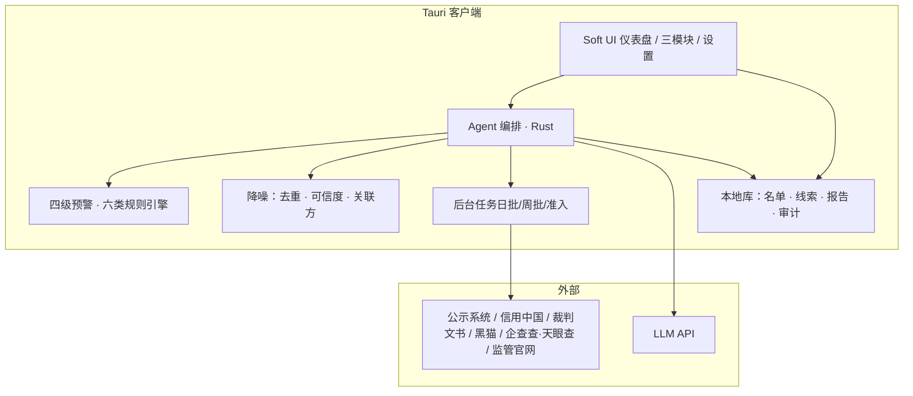

# 智联鉴控 · 合作机构风险管理 AI 智能体客户端 — 产品需求文档（PRD）

| 属性 | 内容 |
|------|------|
| 文档版本 | v1.0 |
| 创建日期 | 2026-07-30 |
| 产品名称 | 智联鉴控（Axiom Risk Agent） |
| 产品定位 | 面向风控/合规/业务的合作机构全生命周期 AI 智能风控客户端 |
| 技术栈 | Tauri 2.x + Rust + React + TypeScript + Tailwind |
| 文档依据 | 《智联鉴控—合作机构全生命周期 AI 智能风控系统》立项报告；《合作机构风险管理 AI 系统_详细规划》；UI 参考图（软 UI / Soft Dashboard） |
| 文档状态 | 需求基线（待评审） |

---

## 1. 背景

### 1.1 业务上下文

消费金融合作服务商覆盖助贷、融资担保、流量引流、支付清算、数据技术、催收处置等多类主体，数量庞大且常存在「单一机构多业务交叉合作」。监管持续收紧，合规处罚与行业风险传导频发。

现状痛点：

| 痛点 | 表现 |
|------|------|
| 舆情噪声过载 | 现有监测工具月均千余条无效预警，人工核验成本高、精准度不足 |
| 准入流程倒置 | 业务开发与风险核查并行，易埋下合规与经营隐患 |
| 存续期管控碎片化 | 跨主体、跨业务隐性风险难统一捕捉；缺长效闭环 |
| 标准不统一 | 人工审核主观偏差大，评估结果难追溯、难横向对比 |

### 1.2 产品愿景

构建桌面端智能体客户端，以 AI 为核心，覆盖合作机构：

**准入前置核验 → 存续期舆情吹哨 → 季度经营复盘**

三位一体全生命周期风控，充当机构风险前置预警的「智能吹哨人」。

### 1.3 约束与假设

| 类型 | 说明 |
|------|------|
| 使用范围 | 企业内部使用；操作可审计 |
| 客户端形态 | Tauri 本地桌面应用；敏感配置本地加密存储 |
| AI | OpenAI 兼容 API（可配置网关）；核心判定需可解释、可人工复核 |
| 外部数据 | 优先官方/授权通道；企查查/天眼查等商业源须采购授权；公网爬取须合法合规 |
| 数据边界 | MVP 可接 Demo/脱敏数据演示；生产对接合作机构主数据（含 USCC） |
| 分期落地 | 按数据获取难度、算法深度、使用频次分阶段迭代（见第 9 章） |

---

## 2. 目标

### 2.1 产品目标

| 编号 | 目标 | MVP 期望 |
|------|------|----------|
| G1 | 六类合作主体差异化监测与四级预警 | 规则引擎 + 黑猫等可访问源演示 |
| G2 | 每日/每周风险吹哨报告自动生成 | 标准化表格 + 分级推送 |
| G3 | 财报导入与经营四维分析报告 | 支持导入样例年报/季报 |
| G4 | 准入一票否决/重大违规/关注事项实时研判 | 单次触发弹窗 + 意见书 |
| G5 | Soft UI 风格可演示客户端 | 对齐参考图信息架构 |
| G6 | 降噪：去重、可信度分级、关联方传导标注 | 过滤规则可配置 |

### 2.2 非功能目标

| 指标 | 目标 | 说明 |
|------|------|------|
| 日监测跑批 | 全量名单 ≤ 30 分钟（千级主体） | 可后台任务，可断点续跑 |
| 准入单次研判 | ≤ 2 分钟（含 LLM 摘要） | 受外部 API/LLM 影响 |
| 告警时效 | 1 级即时；2 级 24h 内处置闭环 | 客户端内工单态 |
| 本地安全 | API Key / 凭证加密；操作审计日志 | Rust 侧安全存储 |
| 可用性 | 离线可查看历史报告；在线才跑批 | 本地报告库 |

---

## 3. 用户与场景

### 3.1 用户角色

| 角色 | 核心诉求 |
|------|----------|
| 风控人员 | 日监测、风险分级、证据链复核、处置跟踪 |
| 合规人员 | 准入核验、法规对照、处罚/资质存续核查 |
| 业务拓展 | 准入快速结论、有条件通过项清单 |
| 管理层 | 总览仪表盘、周报/季报、高风险机构清单 |
| 管理员 | 数据源、模型/规则、名单、权限配置 |

### 3.2 用户故事

| ID | 作为 | 我想要 | 以便 |
|----|------|--------|------|
| US-01 | 风控 | 每天打开客户端看到昨日新增 1/2 级风险 | 优先处置致命/重大风险 |
| US-02 | 风控 | 按六类主体切换专属监测看板 | 贴合业态差异化盯防 |
| US-03 | 合规 | 对新机构一键跑准入检查清单 | 从源头阻断逆流程合作 |
| US-04 | 分析师 | 导入财报生成经营评估报告 | 替代线下手工拆表 |
| US-05 | 管理 | 看组合风险分与趋势图 | 周会/专委会汇报 |
| US-06 | 管理员 | 配置外部源、LLM、合作名单 | 安全可控上线 |

### 3.3 核心业务场景

1. **日度舆情吹哨**：跑批 → 降噪 → 四级分级 → 标准化风险表 → 1/2 级即时提醒  
2. **周度汇总**：聚合新增/持续发酵事件，折叠重复旧闻  
3. **季度经营守护**：导入报表 → 四维指标 + 融担专项 → 同业对比 → 综合评级  
4. **准入瞭望**：导入拟合作主体 → 一票否决/重大/关注检查 → 通过/有条件/否决  

---

## 4. 功能需求

### 4.1 功能全景



### 4.2 模块一：全域舆情风险吹哨（Risk Whistle）

#### 4.2.1 定位

抓取公开风险线索，自动降噪，对合作机构声誉/合规/经营风险常态化监测。

#### 4.2.2 六类主体专属监测维度

| 主体类型 | 重点监测维度 |
|----------|--------------|
| 助贷机构 | 黑猫投诉舆情、监管处罚约谈、现金流承压信号 |
| 融资担保 | 监管罚单、同业终止合作公示、实控人股权变动 |
| 流量引流 | 同业合作稳定性、持续盈利能力 |
| 支付机构 | 行业监管政策更新、行政处罚记录 |
| 数据服务商 | 数据源合规资质、行业政策前瞻变动 |
| 催收机构 | 暴力催收投诉、司法涉诉记录 |

#### 4.2.3 四级预警体系

| 等级 | 标签 | 含义 | 客户端处置 |
|------|------|------|------------|
| 1 级 | 致命 | 监管红线或存续性威胁 | 即时弹窗 + 暂停新增建议 + 上报待办 |
| 2 级 | 重大 | 指标恶化/合规隐患，可能升级 | 24h SLA 工单 + 业务确认 |
| 3 级 | 关注 | 偏离正常或行业需关注信号 | 月度台账 + 趋势跟踪 |
| 4 级 | 信息 | 常规变化/行业动态 | 备查 + 定期报告附录 |

映射关系：1 级 ⇄ 红；2+3 级 ⇄ 黄（细分为重大/关注）；4 级 ⇄ 蓝。

详细触发条件以《详细规划》第 1.1～1.2 节风险点表为准（融担放大倍数、助贷综合成本超 24%、支付牌照注销、数据刑事立案、催收暴力立案等），客户端规则库须可配置、可版本化。

#### 4.2.4 智能体过滤规则（必做）

| 规则 | 措施 | 目的 |
|------|------|------|
| 关联方同步监测 | 同步母公司/子公司/重要联营舆情，标注传导来源 | 捕捉跨实体传导 |
| 历史旧闻去重 | 首次出现时间戳；上周期已报事件折叠为「重复」 | 聚焦新增与持续发酵 |
| 信息源可信度 | A 官方文书 / B 媒体实锤 / C 网传待核实 | 避免谣言误触发 |

#### 4.2.5 运行机制与输出

- 模式：日度监测 + 周度汇总  
- 输出：标准化风险条目表（线索 ID、主体、USCC、类型、等级、摘要、来源、可信度、事件日、处置状态）  
- 聚合：同一事件多机构 → 以事件为主体聚合展示  

#### 4.2.6 外部数据源（对接优先级）

| 优先级 | 数据源 | 频度 | MVP |
|--------|--------|------|-----|
| P0 | 国家企业信用信息公示系统、信用中国、执行公开、监管官网 | 日 | 能通则通；不通则标注受阻 |
| P0 | 企查查/天眼查（商业 API） | 日 | 需授权后接入 |
| P1 | 黑猫投诉 | 日/小时 | MVP 优先（公开页已验证） |
| P1 | 裁判文书网 | 周 | 登录/合规采集方案待定 |
| P1 | 央行/各地金融局/银行合作名单公示 | 日/周 | 政策与名单核验 |

### 4.3 模块二：经营状况智能守护（Business Guardian）

#### 4.3.1 定位

批量导入年报/季报、在保台账、内部管控指标，自动拆解经营实力，输出季度评估报告。

#### 4.3.2 分析维度

| 维度 | 内容示例 |
|------|----------|
| 盈利能力 | 营收、净利、净利率、ROA/ROE、收入结构 |
| 偿债能力 | 资产负债率、流动/速动比率、产权比率 |
| 运营能力 | 周转、在贷/放款规模变化、不良相关（若可得） |
| 现金流 | 经营现金流、FCF、CAPEX/收入 |
| 融担专项 | 放大倍数、代偿率、拨备覆盖、集中度、资产比例、造假识别信号 |

#### 4.3.3 输出

- 标准化经营评估表 + 可视化（横向同业、纵向时序）  
- 综合评级（如 A/A-/B+…）与关注点列表  
- 样例逻辑可参考《详细规划》乐信 2025 年报分析结构（演示用）

### 4.4 模块三：业务拓展智能瞭望（Admission Scout）

#### 4.4.1 定位

准入/续约/重大事件再审时，实时合规前置核验，解决「先合作后尽调」。

#### 4.4.2 检查结构

| 判定维度 | 内容概要 | 结果 |
|----------|----------|------|
| 一票否决（约 8 项） | 严重违法失信、吊销许可、吸收存款、融担放大倍数超限、为实控人担保、实控人失联、股权冻结>30%、暴力催收/侵公信息刑事立案等 | 触发/未触发 |
| 重大违规（约 10 项） | 未入名单制、融资成本>24%、大额处罚、融担集中度/造假、准备金不足、违规催收、同业解约、数据合规质疑、资质异常、评级下调等 | 触发 N 项 |
| 关注事项（约 7 项） | 不良恶化、营收下滑、非标审计、管理层变更、大额诉讼、监管评级 C/D、催收投诉异常等 | 触发 N 项 |
| 综合结论 | — | 通过 / 有条件通过 / 否决 |

按机构类型自动切换检查项；输出准入意见书与整改清单。

### 4.5 跨模块公共能力

| 能力 | 说明 |
|------|------|
| 合作机构主数据 | 全称、简称、集团、USCC、类型标签、关联方、合作状态 |
| 规则与关键词库 | 主体词 AND 风险关键词双条件匹配；月更 |
| Agent 对话辅助 | 自然语言查询「某机构昨日风险」「生成本周吹哨摘要」 |
| 报告导出 | HTML/Markdown；PDF 为后续 |
| 审计 | 查询、跑批、准入结论、人工改级均留痕 |

---

## 5. 信息架构与 UI 需求（对齐参考图）

### 5.1 视觉风格

参考附图 Soft Dashboard（axiom 风）：

| 要素 | 规范 |
|------|------|
| 主题 | 浅色；柔和灰白底 + 白卡片；轻阴影、大圆角（约 20～28px） |
| 主色 | 淡紫/紫强调色（导航激活、主按钮、图表高亮） |
| 辅色 | 柔和蓝/黄/桃等用于六类主体色标与进度 |
| 字体 | 现代无衬线；标题加粗、元数据浅色小号 |
| 图标 | 细线图标，风格统一 |
| 组件 | 圆角卡片、胶囊按钮、细进度条、半环仪表盘 |

> 本产品 UI 以用户提供的参考图为设计基线；实现时抽取 CSS 变量（`--accent`、`--surface`、`--radius` 等）便于后续换肤。

### 5.2 整体布局（四区）

```
┌────────┬─────────────────────────────┬──────────┐
│ Logo   │ Welcome back, {User}  🔍 🔔 👤 │          │
│ 导航   ├─────────────────────────────┤ 日历     │
│        │ 六类主体快捷卡片 / 高风险摘要   │ 预警事件 │
│ 总览   │ 趋势柱状图 │ 组合风险分仪表盘   │ 时间线   │
│ 吹哨   │ 标准化风险线索列表 + 进度/处置  │          │
│ 经营   │                             │          │
│ 准入   │                             │          │
│ 设置   │                             │          │
│ Help   │                             │          │
└────────┴─────────────────────────────┴──────────┘
```

### 5.3 页面与组件映射

| 参考图区域 | 本产品映射 |
|------------|------------|
| 左侧导航 | 总览、风险吹哨、经营守护、准入瞭望、机构名单、规则库、设置；底部 Help/反馈 |
| 顶栏 Welcome | 「欢迎回来，{姓名}」+ 全局搜索（机构名/USCC/线索 ID）+ 通知铃 + 头像 |
| Your Courses 卡片行 | 六类主体监测卡：图标色标、昨日新增条数、1/2 级数量、迷你进度（处置完成率） |
| Hours Activity 柱图 | 近 7 日风险线索量/有效线索量趋势；昨日柱高亮 |
| Point Progress 半环 | 组合风险健康分或待处置 1/2 级占比 |
| Learn Basic… 列表 | 最新风险线索表：主体、等级色标、事件日、负责人、处置进度条、操作（复核/继续） |
| 右侧 Calendar | 监测日历（日批/周报/季报节点） |
| 右侧 Events | 实时预警事件流（1/2 级优先） |

### 5.4 关键页面线框要求

**总览 Dashboard**

- 顶部 KPI：昨日有效线索、1 级、2 级、待复核  
- 六类卡片可点击进入该类型过滤视图  
- 中部趋势 + 健康分  
- 底部线索列表默认「昨日新增」  

**风险吹哨**

- 筛选：日期、类型、等级、可信度、主体  
- 详情抽屉：原文摘要、证据链接、关联方、AI 分级理由、人工改级  

**经营守护**

- 导入区（拖拽财报/台账）+ 任务进度  
- 报告页：四维卡片 + 融担专项表 + 评级结论  

**准入瞭望**

- 主体录入/选择 → 一键研判  
- 检查清单三色结果 + 综合结论按钮区  
- 导出准入意见书  

**设置**

- LLM、外部数据源开关与凭证、跑批调度、规则版本、主题微调  

---

## 6. Agent 与交互需求

### 6.1 Agent 能力边界（MVP）

| 能力 | 行为 |
|------|------|
| 意图识别 | 监测跑批 / 查机构 / 解读财报 / 准入检查 / 生成周报 |
| 工具调用 | 名单查询、线索检索、规则匹配、财报解析、报告渲染、外部源适配器 |
| 输出 | 结构化 JSON（供 UI 绑定）+ 自然语言摘要 |
| 人机协同 | 1/2 级必须人工确认后方可关闭；AI 不可静默销案 |

### 6.2 对话入口

- 顶栏或浮动「问鉴控」：例如「汇总昨天催收类高风险」「对 XX 融担做准入预检」  
- 回答须引用线索 ID / 规则条款，禁止无来源断言  

---

## 7. 数据与本地存储（客户端侧）

| 实体 | 关键字段 |
|------|----------|
| partner | id, name, alias, group_name, uscc, type, status, related_parties |
| risk_clue | clue_id, partner_id, risk_type, level, summary, source, credibility, event_time, evidence_hash, denoise_flag, status |
| finance_report | partner_id, period, metrics_json, rating, file_ref |
| admission_case | case_id, partner_id, veto_flags, major_flags, watch_flags, conclusion, opinion |
| audit_log | actor, action, target, ts, detail |

存储：SQLite（Rust 侧）或等价本地库；密钥走系统钥匙串/加密配置。

---

## 8. 非功能与合规

| 类别 | 要求 |
|------|------|
| 安全 | 凭证不明文；最小权限；导出脱敏选项 |
| 合规取数 | 商业源须合同授权；官方源失败时明确「源站受阻」而非伪造数据 |
| 可解释 | 每条预警展示命中规则、关键词、来源等级 |
| 性能 | UI 60fps 目标；大列表虚拟滚动 |
| 兼容 | macOS / Windows（MVP 可先 macOS） |

---

## 9. 分期规划

| 阶段 | 范围 | 周期建议 |
|------|------|----------|
| M1 MVP | Soft UI 壳 + 总览 + 吹哨（黑猫+规则降噪+四级展示）+ 本地名单 Demo | 3～4 周 |
| M2 | 准入瞭望清单引擎 + 报告导出 + LLM 摘要 | 3 周 |
| M3 | 经营守护财报解析 + 融担专项 + 季报模板 | 3～4 周 |
| M4 | 企查查/天眼查 API、信用中国/公示核验、调度稳定化 | 视采购与权限 |

配套模型（立项所述 BERT/LSTM/XGBoost/知识图谱等）列为 **规划中**：MVP 以规则引擎 + LLM 辅助为主，模型替换为后续增强项。

---

## 10. 验收标准（MVP）

| 编号 | 验收项 |
|------|--------|
| A1 | 客户端可启动，UI 布局符合四区 Soft Dashboard 结构 |
| A2 | 可导入 ≥20 家 Demo 合作机构（覆盖六类） |
| A3 | 对指定日期可生成吹哨表；含降噪标记与四级等级 |
| A4 | 黑猫类公开投诉可展示为风险线索（有源链接） |
| A5 | 1 级线索触发强提醒；可创建处置状态流转 |
| A6 | 准入模块对样例机构输出通过/有条件/否决之一及清单勾选结果 |
| A7 | 关键操作写入审计日志；LLM Key 加密保存 |

---

## 11. 范围外（本期不做）

- 替代银行核心信贷决策系统  
- 无授权条件下的大规模站点破解/绕过验证码  
- 完整知识图谱生产训练平台（仅预留接口）  
- 移动端 App  

---

## 12. 待决问题

| 编号 | 问题 | 影响 |
|------|------|------|
| Q1 | 企查查/天眼查采购主体与额度 | P0 工商司法深度数据 |
| Q2 | 合作机构主数据是否已有 USCC 全量 | 精准匹配 |
| Q3 | 1 级告警是否必须对接企业微信/邮件 | 触达通道 |
| Q4 | 与现有 DataPulse 客户端是同仓多应用还是独立仓库 | 工程组织 |

---

## 13. 附录

### 13.1 文档溯源

- 立项报告：三大模块、六类差异化监测、多源数据、分阶段落地价值  
- 详细规划：四级预警明细、财务分析模板、违规红橙黄清单、输出模板、法规与数据源矩阵、关键词清单  

### 13.2 标准化风险表字段（吹哨）

`clue_id · partner_name · uscc · partner_type · risk_type · level · summary · source_system · source_url · credibility · event_time · first_seen_at · denoise_status · related_party_flag · owner · sla_due_at · status`

### 13.3 UI 设计 Token（建议）

```css
--bg: #f3f0f8;
--surface: #ffffff;
--accent: #7c5cfc;
--accent-soft: #ece7ff;
--text: #1f2937;
--text-muted: #9ca3af;
--radius-lg: 24px;
--radius-md: 16px;
--shadow: 0 8px 24px rgba(31, 41, 55, 0.06);
```

---

## 14. 总结

本 PRD 定义 **Tauri + Rust** 桌面智能体「智联鉴控」：在 Soft UI 仪表盘交互下，落地合作机构全生命周期三大能力——**舆情吹哨、经营守护、准入瞭望**，并以六类主体专属维度与四级预警规则实现可解释、可处置、可审计的风险监测闭环。MVP 优先打通 UI、名单、规则降噪与黑猫等可达数据源，商业征信与深度模型按授权与阶段迭代接入。
